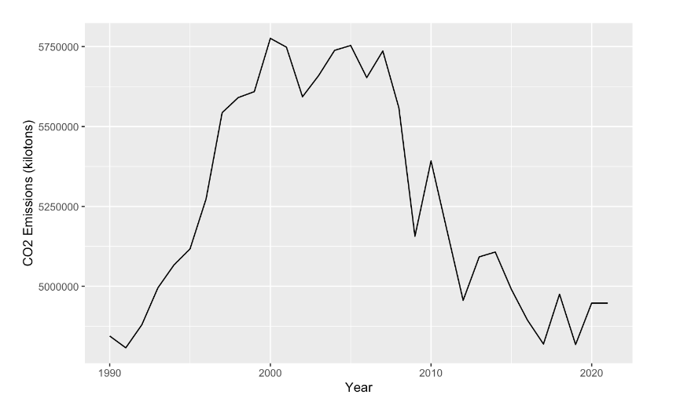
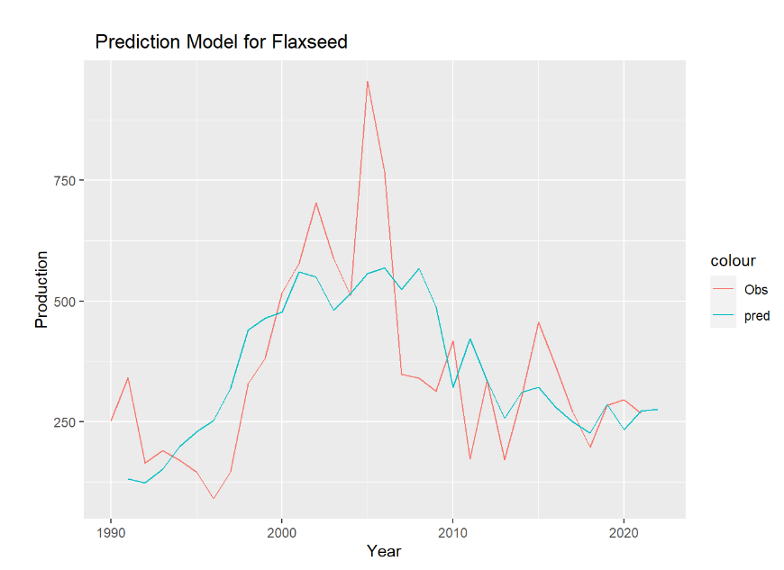

## HOW DOES US CROP PRODUCTION IMPACT CLIMATE CHANGE?

This comes from the file `content/big_picture.Rmd`.

The central goal of our project is to examine if there is a relationship between the production of agricultural crops in the United States and the output of carbon dioxide into the atmosphere from the United States.
One of the most common ways of offsetting greenhouse gas emissions is through planting vegetation.
However, commercial agriculture, the type of agriculture that dominates the US farming economy, has come under scrutiny for its lack of sustainability and the harms it causes to the environment.
Thus, we wanted to explore if there is some relationship between the most commonly produced crops in the US, as well as other related economic variables.

The first figure we analyzed was simply examining how the CO2 emissions from the US have changed over time.
Historically, CO2 emissions have been on the rise since the 1950s.
However, in the past 10 years we have actually seen a decrease in CO2 emissions, contrary to what many may believe, as well as against overall global trends.
This is most likely due to the effects of the US taking steps to combat climate change and its carbon footprint.
We found this to be quite interesting and were still curious with how this may impact the overall crop production.

We specifically chose to conduct an in depth analysis of barley, corn, and flaxseed production in the US, as well as other related agricultural variables such as the area of land used for harvesting, yield per harvest, and monetary value of the harvest for each year for the last 30+ years.
We found no correlation between demand for crops and GDP growth, as well as demand for crops and CO2 Emissions.
There was also no clear relationship between area harvested for each crop and forest area percentage, as we saw different relationships between the two for each crop.

We ran correlation analyses between crop output for each individual crop and CO2 output, as that was our primary relationship of interest.
We then analyzed the results to see if we could feasibly make a prediction of crop output and CO2 emissions for the future using our data.
We found that this was only possible for flaxseeds.
Using our data, we were able to predict the total CO2 emissions and flaxseed production.
Overall, our results suggest that there is no significant relationship between CO2 and overall crop production.
However, there was a significant relationship between flaxseed production and CO2 output, suggesting that this specific crop may have more of an impact on the environment than others.

Since flaxseed was the only crop to have a direct correlation between CO2 emissions and production, we decided to conduct an ARIMA Time Series analysis of flaxseed production in order to predict what the production of flax seeds would be for the next year.
The above figure highlights the accuracy of our time series prediction model against the actual observed data points.
From our model, we predict that the US will produce approximately 276640.1 bushels of flaxseed.

------------------------------------------------------------------------

### Interactive

<https://vsawhney.shinyapps.io/dashboard/>

Our interactive component focuses specifically on our flaxseed data.
We chose to do this specifically because flaxseeds were the only crop to show a statistically significant correlation between CO2 emissions and production.
Our interactive component has 2 separate figures.
The first figure depicts the production of flaxseed in 1000s of bushels vs time for each year analyzed.
Each data point is colored by the specific CO2 emissions for the corresponding year, and the size of each dot represents the corresponding crop yield for each year.
Each data point also allows the user to learn the corresponding economic value of flaxseed per year.

The second figure depicts CO2 emissions vs production output of flaxseeds. Specifically, it allows the user to see how there is indeed a slight negative relationship between CO2 emissions and flaxseed output.

The third figure is a data table specifically focusing on the 3 primary variables of interest in our analysis. The CO2 emissions column is also a bar chart with relative sizes of the bar representing the total emissions for the corresponding year. The flaxseed production column is also color coded to represent the different amounts of production for each year. Specifically, red years represent less than 5000000 bushels produced, blue between 5 million and ten million bushels in a year, and green greater than ten million bushels produced in the year. This creates another visual way for the user to see that there is a slight positive correlation between CO2 emissions and flaxseed production.  

------------------------------------------------------------------------

### Video Recording
